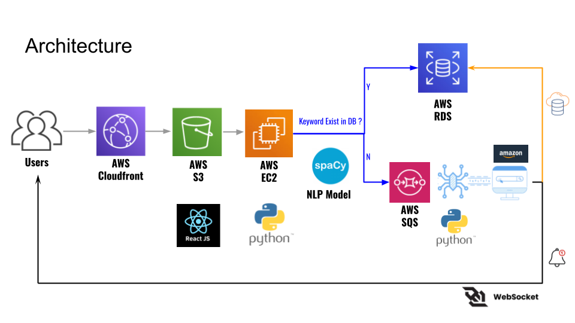

# MarketMaster

MarketMaster is a tool designed to assist Amazon sellers in analyzing market trends and making informed decisions about their product listings. Key features include product search, data crawling, and market analysis.

## Table of Contents

- [Intention](#intention)
- [Features](#features)
- [Installation](#installation)
- [Usage](#usage)
- [Technologies Used](#technologies-used)
- [Architecture](#architecture)

## Intention
Amazon sellers often face the challenge of determining whether a product idea is viable before committing significant time and resources. The market can be saturated, competition fierce, and trends difficult to predict. MarketMaster addresses these challenges by providing comprehensive market analysis, visualizations, and real-time data crawling. This tool enables sellers to assess market saturation, understand competition, and make informed decisions about their product listings. By using MarketMaster, sellers can pivot and choose more promising products, ultimately saving time and reducing the risk of entering overly saturated markets.

## Features

- **Product Search:** Enables users to search for products using specific keywords.
- **Data Crawling:** Retrieves product data from Amazon.
- **Market Analysis and Visualization:** Offers detailed market analysis including seller count, price range, average price, rating, and reviews, visualized charts and suggested product titles.
- **User Management:** Users can create accounts, save searches, and manage their preferences.

## Installation

1. Clone the repository:
    ```sh
    git clone https://github.com/yourusername/marketmaster.git
    ```
2. Navigate to the project directory:
    ```sh
    cd marketmaster
    ```
3. Install main application dependencies:
    ```sh
    pip install -r requirements.txt     # Install Python dependencies for the backend
    npm install                         # Install Node.js dependencies for the React frontend
    ```
4. Install worker application dependencies:
    ```sh
    pip install -r requirements_worker.txt
    ```
5. Download spaCy language model:
    ```sh
    python -m spacy download en_core_web_sm
    ```
6. Set up the database by importing the backup file:
    ```sh
    mysql -u root -p < dump20240715.sql
    ```
7. Run the main application:
    ```sh
    uvicorn app:app --reload
    ```
8. Run the worker application:
    ```sh
    xvfb-run -a python worker.py
    ```

## Usage

Access the application at [https://annchenstudio.com](https://annchenstudio.com).

1. Open your browser and navigate to `https://annchenstudio.com`.
2. Use the search bar to input a product keyword.
3. View the search results and analysis on the respective pages.
4. Example of keywords existing in the database:
    - accessory
    - action figure
    - Air Fryer
    - air purifier
    - Amazon fire TV stick
    - ant killer
    - anti slip dog paw pads
    - Apple AirPods
    - Apple AirTag
    - bag
    - bed sheet
    - bicycle
    - board game
    - body lotion
    - camera
    - camping gear
    - car part
    - children's book
    - crocs
    - cushion foundation
    - disposable face towel
    - earring
    - educational toy
    - engagement gifts
    - External Hard Drive
    - fiction
    - Fitbit
    - fitness equipment
    - fitness tracker
    - flat back stud earrings
    - fly trap
    - furniture
    - grooming product
    - headphone
    - health supplement
    - home decor
    - hydrating serum for face
    - kitchen gadgets
    - laptop
    - laptops
    - lego
    - makeup
    - makeup remover wipes
    - mascara
    - men's clothing
    - microphone
    - microwave
    - monitor
    - Nintendo Switch
    - non-fiction
    - personalized cutting board
    - pet food
    - pet toy
    - pillow case
    - ping pong paddle
    - portable bluetooth speaker
    - printer
    - puzzle
    - refrigerator
    - skincare product
    - smartphone
    - smartphones
    - smartwatch
    - sports equipment
    - SSD
    - sun protection shirts
    - tablet
    - taiwanese oolong tea bags
    - tazo decaffeinated chai tea bags
    - tech golf polo
    - tupperware organizer for pantry
    - textbook
    - vacuum cleaner
    - washing machine
    - water shoes
    - Wireless Earbuds
    - women's clothing
    - snoopy cup
    - snoopy shirt
    - water bottle
    - snoopy blanket


## Technologies Used

- **Frontend:** React
- **Backend:** Python, FastAPI
- **Database:** AWS RDS (MySQL)
- **Crawling:** Python Playwright
- **Deployment:** Docker, AWS EC2
- **Natural Language Processing:** spaCy NLP
- **Other Services:** AWS SQS, AWS CloudFront, AWS S3, WebSockets for real-time notifications

## Architecture


